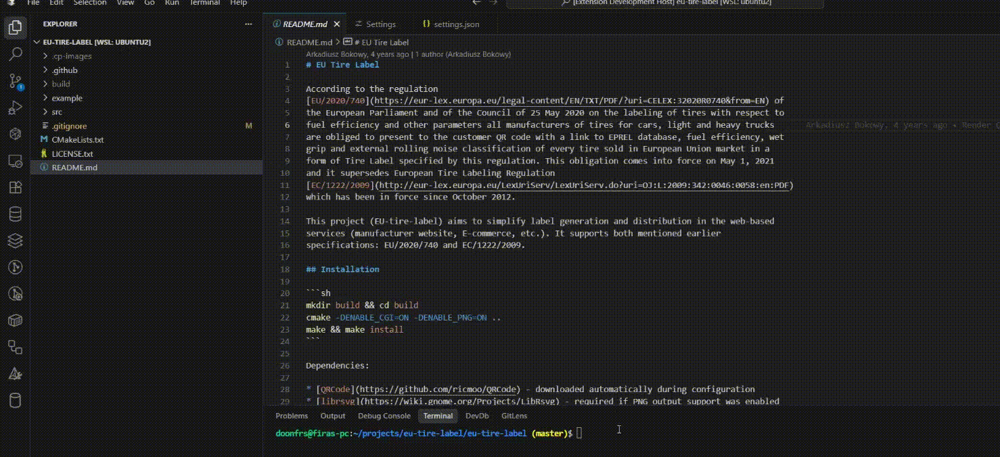

# Terminal Paste Image



A VS Code extension that seamlessly pastes clipboard images directly into your terminal, automatically saving them to your project and inserting the file path. Perfect for Claude Code users and any workflow that requires quick image sharing in terminal environments.

**⭐ If this extension saves you time and makes your workflow smoother, please consider starring the repository! Your support means the world to us and helps the project grow. ⭐**

## ☕ Support

If this extension helps you, consider supporting the development:

[](https://buymeacoffee.com/doonfrs)

**Your support helps maintain and improve this extension!**

## 🚀 Features

- **Zero Configuration Required** - Works out of the box across all platforms
- **Cross-Platform Support** - Windows, macOS, Linux, and WSL/WSL2 compatible
- **Smart Clipboard Detection** - Automatically detects when images are in your clipboard
- **Automatic File Management** - Saves images to configurable folder (default: `.cp-images/`) with timestamps
- **Instant Path Insertion** - Immediately inserts the relative path into your active terminal
- **Claude Code Optimized** - Perfect for sharing images with Claude Code AI assistant
- **WSL Integration** - Seamless PowerShell integration for WSL environments
- **Keyboard Shortcut** - Quick `Ctrl+Alt+V` (Windows/Linux) or `Cmd+Alt+V` (macOS)
- **Terminal Focus Aware** - Only activates when terminal is in focus
- **Multiple Image Formats** - Supports PNG and other common clipboard image formats
- **Smart Git Integration** - Automatically adds images folder to .gitignore (configurable)
- **Customizable Folder Name** - Configure where images are saved (default: `.cp-images/`)
- **Automatic Cleanup** - Keeps only recent images (default: 10) to prevent folder bloat

## 📋 Prerequisites

- Visual Studio Code 1.74.0 or higher
- For Windows/WSL: PowerShell (included by default)
- For macOS: `pngpaste` utility (install via `brew install pngpaste`)
- For Linux: `xclip` utility (install via your package manager)

## 🌟 Show Your Support

If you find this extension useful:

- ⭐ **Star this repository** on GitHub
- 📝 **Leave a review** on the VS Code Marketplace
- 🐛 **Report issues** or suggest features
- 💬 **Share** with other developers

## 🎯 Use Cases

### Claude Code Integration
Perfect for sharing screenshots, diagrams, or images with Claude Code AI assistant:
1. Copy any image to clipboard (screenshot, design, diagram)
2. Press `Ctrl+Alt+V` in terminal
3. Image path is automatically inserted for Claude Code to reference

### General Development
- Share UI mockups or designs with team members
- Include error screenshots in bug reports
- Add visual context to code discussions
- Document visual issues or features

### Documentation
- Quickly include screenshots in documentation workflows
- Save and reference images during technical writing
- Create visual guides and tutorials


## ⚙️ Installation

### From VS Code Marketplace
1. Open VS Code
2. Go to Extensions (`Ctrl+Shift+X`)
3. Search for "Terminal Paste Image"
4. Click "Install"

### From VSIX
1. Download the latest `.vsix` file from releases
2. Open VS Code
3. Press `Ctrl+Shift+P` and type "Install from VSIX"
4. Select the downloaded file


## 🔧 Usage

### Basic Usage
1. Copy an image to your clipboard (screenshot, image file, etc.)
2. Focus on any terminal in VS Code
3. Press `Ctrl+Alt+V` (Windows/Linux) or `Cmd+Alt+V` (macOS)
4. The image is saved to your configured folder and path is inserted in terminal

### Command Palette
- Open Command Palette (`Ctrl+Shift+P`)
- Type "Paste Image to Terminal"
- Execute the command

### Right-Click Context Menu
The extension integrates with the command palette and keyboard shortcuts - no additional context menu items.


## 🛠️ Platform-Specific Setup

### Windows
- Works out of the box with PowerShell
- No additional setup required

### WSL/WSL2
- Automatically detects WSL environment
- Uses Windows PowerShell for clipboard operations
- No additional configuration needed

### macOS
Install `pngpaste` for optimal performance:
```bash
brew install pngpaste
```

### Linux
Install `xclip` for clipboard operations:
```bash
# Ubuntu/Debian
sudo apt-get install xclip

# Fedora/RHEL
sudo dnf install xclip

# Arch
sudo pacman -S xclip
```


## 📁 File Organization

Images are automatically saved to:

```text
your-project/
├── .cp-images/
│   ├── pasted-image-2024-01-15T10-30-45.png
│   ├── pasted-image-2024-01-15T10-31-02.png
│   └── ...
```

Path format inserted in terminal:

```text
.cp-images/pasted-image-2024-01-15T10-30-45.png
```


## ⌨️ Keyboard Shortcuts

| Platform | Shortcut |
|----------|----------|
| Windows/Linux | `Ctrl+Alt+V` |
| macOS | `Cmd+Alt+V` |

**Note**: Shortcuts only work when terminal is focused to avoid conflicts with normal paste operations.


## ⚙️ Configuration

The extension provides several configuration options that can be customized in VS Code settings:

### Settings

| Setting | Type | Default | Description |
|---------|------|---------|-------------|
| `terminalPasteImage.folderName` | string | `.cp-images` | Name of the folder where pasted images will be saved |
| `terminalPasteImage.autoGitIgnore` | boolean | `true` | Automatically add the images folder to .gitignore if not present |
| `terminalPasteImage.maxImages` | number | `10` | Maximum number of images to keep (older images are automatically deleted) |

### Accessing Settings

1. Open VS Code Settings (`Ctrl+,` or `Cmd+,`)
2. Search for "Terminal Paste Image"
3. Modify the settings as needed

### Auto .gitignore Management

By default, the extension will:
- Check if a `.gitignore` file exists in your workspace
- Verify if your images folder is already ignored
- Automatically add the folder to `.gitignore` if not present
- Add a helpful comment indicating it's for Terminal Paste Image

This behavior can be disabled by setting `terminalPasteImage.autoGitIgnore` to `false`.

### Custom Folder Configuration

You can change the default folder name from `.cp-images` to any folder name you prefer:

```json
{
  "terminalPasteImage.folderName": "screenshots"
}
```

The folder will be created relative to your workspace root.

### Image Management

By default, the extension keeps only the 10 most recent images to prevent folder bloat:

```json
{
  "terminalPasteImage.maxImages": 10
}
```

- When you paste a new image, older images beyond the limit are automatically deleted
- Images are sorted by modification time (newest kept, oldest deleted)
- Only images matching the `pasted-image-*.png` pattern are managed
- Set to a higher number if you need to keep more images
- Minimum value is 1, maximum is 100

## 🤝 Contributing

Contributions are welcome! Please feel free to submit a Pull Request. For major changes, please open an issue first to discuss what you would like to change.

### Development Setup
1. Clone this repository
2. Run `npm install`
3. Open in VS Code
4. Press `F5` to launch extension development host
5. Test your changes


## 📝 Changelog

### v0.0.1
- Initial release
- Cross-platform clipboard image detection
- Automatic image saving with timestamps
- Terminal path insertion
- WSL/WSL2 support
- Keyboard shortcut integration
- Configurable folder name (default: `.cp-images/`)
- Auto .gitignore management
- Smart git integration settings
- Automatic image cleanup (keeps last 10 images by default)
- Configurable maximum image count (1-100)


## 🐛 Known Issues

- macOS requires `pngpaste` utility for best experience
- Linux requires `xclip` for clipboard operations
- Some image formats may need conversion to PNG

## 📄 License

This project is licensed under the MIT License - see the [LICENSE](LICENSE) file for details.

---

## 💬 Connect

- 🐙 **GitHub**: [@doonfrs](https://github.com/doonfrs)
- ☕ **Support**: [Buy me a coffee](https://buymeacoffee.com/doonfrs)

**Made with ❤️ for the VS Code and Claude Code community**
